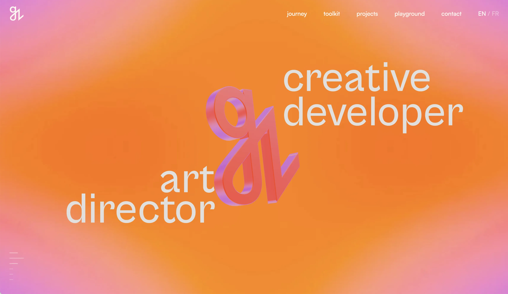
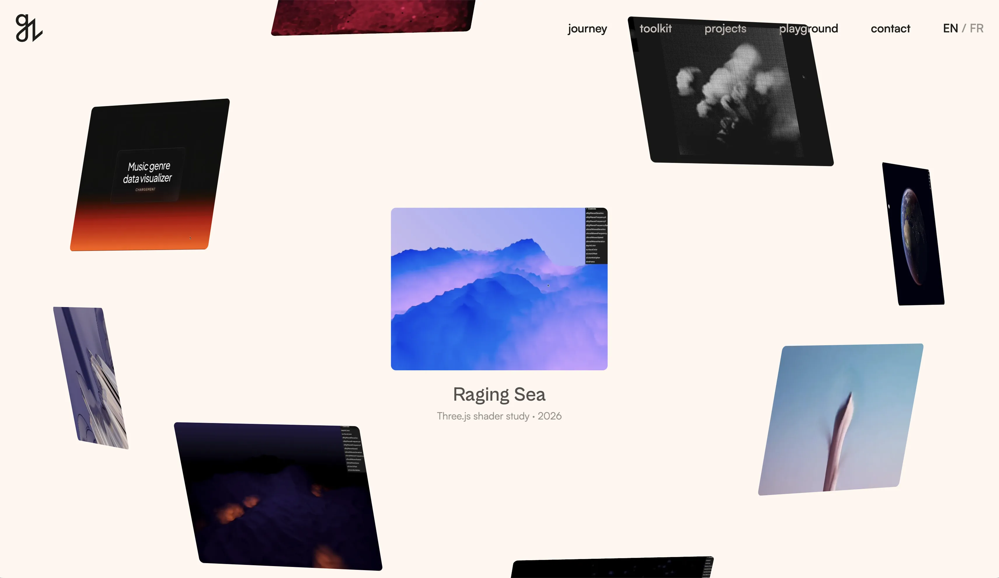

# Guillaume Zhu - Portfolio

Personal portfolio of **Guillaume Zhu**, Front Creative Developer & Art Director.

Coming from a background in art direction and digital design, I later transitioned into front-end development and creative coding. This portfolio is the result of that journey, a fusion of visual direction, interaction design and creative development.

## Preview

### Home

### Project

### Playground

## About

The portfolio brings together selected projects across creative development, web design, branding and art direction.

The experience was designed and developed from scratch with a strong focus on:

- Interactive storytelling
- WebGL and Three.js experiences
- Motion and transitions
- Visual consistency across projects
- Creative coding

## Selected Projects

### Memories of Ghibli

An immersive Three.js experience inspired by the visual worlds of Studio Ghibli, combining interactive exploration, 3D assets and creative development.

### Mirage

A creative studio concept exploring fashion, beauty and digital experiences through art direction, motion and front-end development.

### Pulse Festival

Art direction and visual identity developed across three editions of a cultural festival, spanning digital and physical communication.

### Ornate

Brand identity and digital art direction for a fictional architecture studio.

### Maë

A Webflow portfolio focused on art direction, editorial layouts and GSAP interactions.

## Playground

A collection of creative experiments and visual studies exploring:

- Three.js
- GLSL shaders
- Generative visuals
- Motion design
- Interface design
- 3D
- Creative coding

## Stack

**Development**

HTML · CSS · JavaScript · Vite

**Creative Development**

Three.js · GLSL · GSAP · Matter.js

**Design**

Figma

## Live Website

[guillaumezhu.com](https://guillaumezhu.com)

---

Designed and developed by **Guillaume Zhu**.
